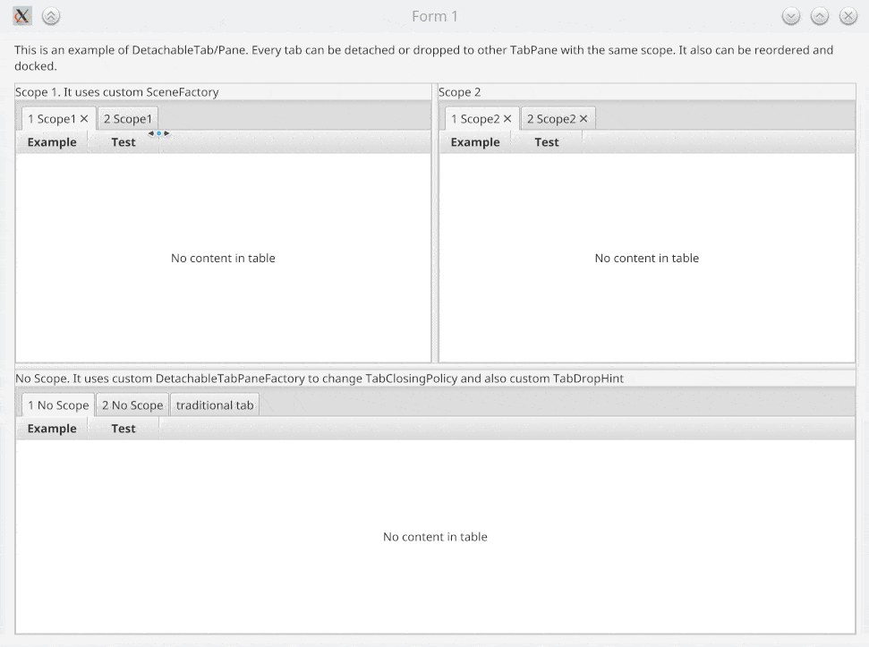

# TiwulFX Dock

[](https://www.jfx-central.com/libraries/tiwulfxdock)

TiwulFX-Dock provides enhanced JavaFX TabPane that supports tab reordering, detaching and docking.



## Usage

Check latest release version in [maven repo](https://repo1.maven.org/maven2/com/panemu/tiwulfx-dock/). Maven dependency:
```
<dependency>
   <groupId>com.panemu</groupId>
   <artifactId>tiwulfx-dock</artifactId>
   <version>${version.tiwulfx-docx}</version>
</dependency>
```

Wrap DetachableTabPane inside a SplitPane. Below is an example in FXML file:
```
<SplitPane VBox.vgrow="ALWAYS">
	<items>
		<DetachableTabPane fx:id="myTabPane" />
	</items>
</SplitPane>
```

Then if the java class file has a variable holding reference to the DetachableTabPane, then add this
```
myTabPane.setOnClosedPassSibling((sibling) -> myTabPane = sibling);
```

## Customization

All of the following customization examples are shown in the demo projects.

When a tab is detached, a stage is created. Set the owner of the stage with this code:
```
myTabPane.setStageOwnerFactory((stage) -> getScene().getWindow());
```

To customize how detached stage looks like, use custom scene factor as follow:
```
myTabPane.setSceneFactory((param) -> {
	FrmScope1 frm = new FrmScope1();
	SplitPane sp = new SplitPane(param);
	VBox.setVgrow(sp, Priority.ALWAYS);
	frm.getChildren().add(sp);
	Scene scene1 = new Scene(frm);
	return scene1;
});
```

Take a look at styles in [tiwulfx-dock.css](https://github.com/panemu/tiwulfx-dock/blob/main/src/main/resources/com/panemu/tiwulfx/control/dock/tiwulfx-dock.css).
Provide your own version of the styles to override the style of drop guiding path and adjacent drop buttons. For a further customization of the drag-drop indicator, extends [TabDropHint](https://github.com/panemu/tiwulfx-dock/blob/main/src/main/java/com/panemu/tiwulfx/control/dock/TabDropHint.java) class
and supply the instance of it to the tab pane:
```
myTabPane.setDropHint(new CustomDropHint());
```

All these customization examples are shown in the demo projects.


## License

MIT
